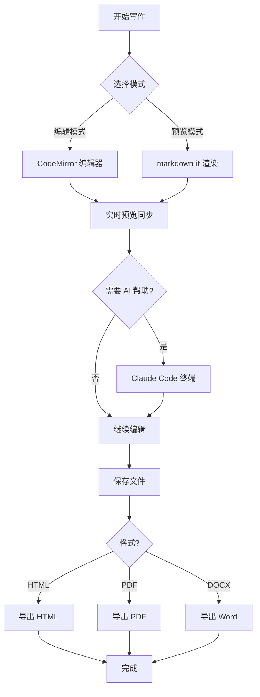
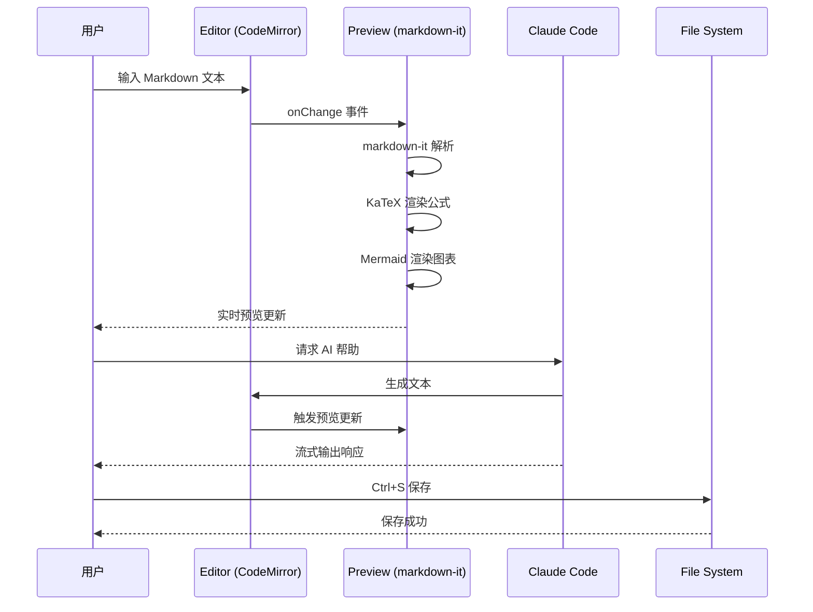
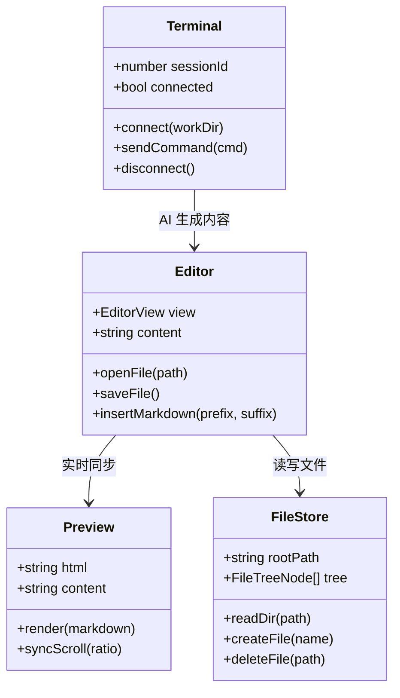
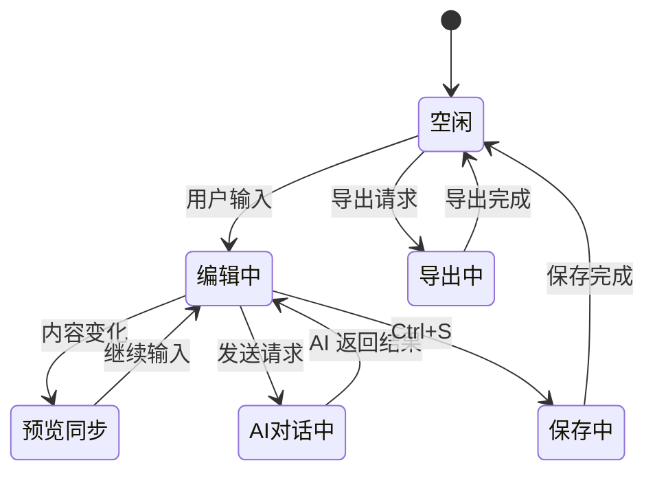
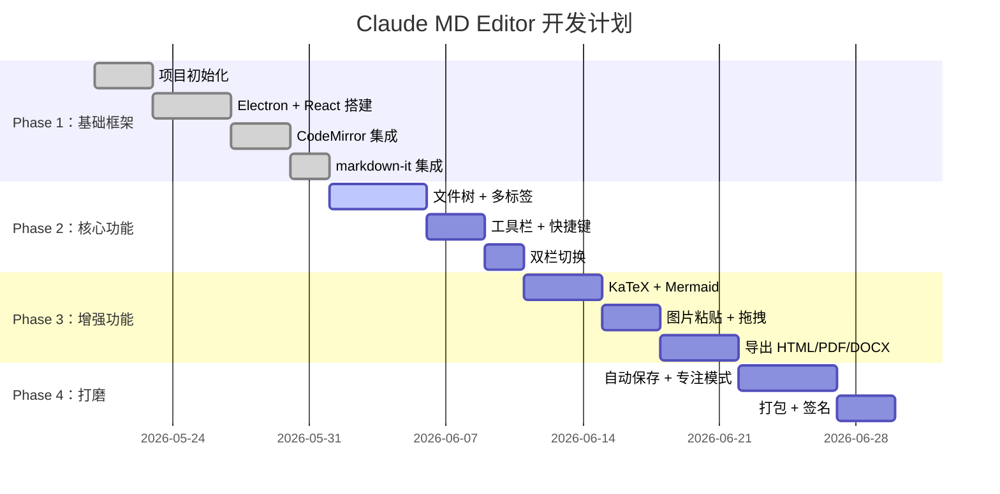
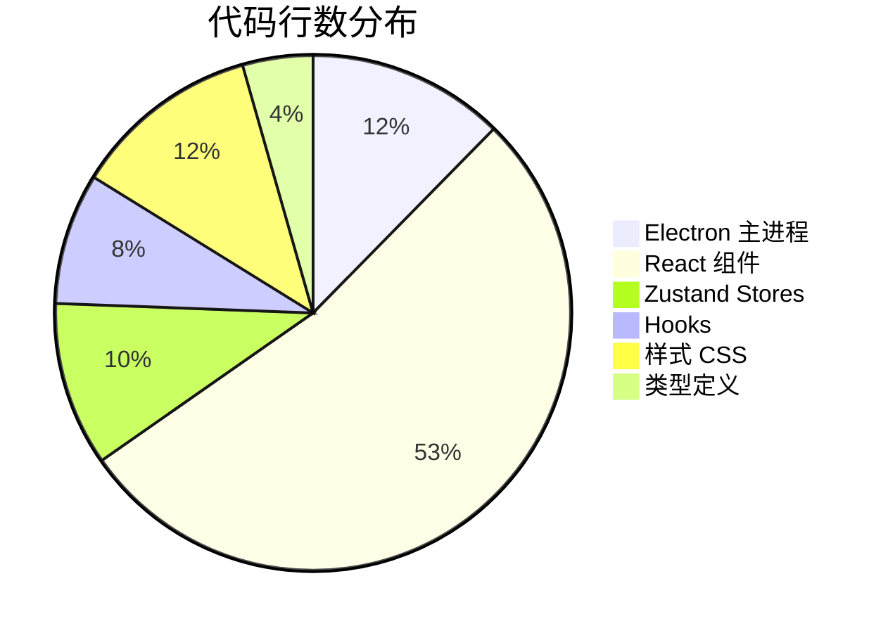
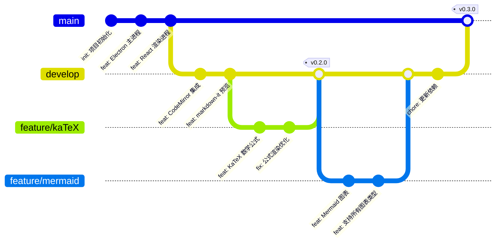

# Claude MD Editor — 功能测试文档

> 本文档用于测试 Markdown 编辑器的各项渲染功能，涵盖标题、文本样式、列表、表格、代码、公式、Mermaid 图表等。

---

## 一、标题层级测试

# 一级标题 H1
## 二级标题 H2
### 三级标题 H3
#### 四级标题 H4
##### 五级标题 H5
###### 六级标题 H6

---

## 二、文本样式测试

- **这是加粗文本（Bold）**
- *这是斜体文本（Italic）*
- ~~这是删除线文本（Strikethrough）~~
- `这是行内代码（Inline Code）`
- ==这是高亮标记（Mark / Highlight）==
- 这是上标：E = mc^2^
- 这是下标：H~2~O
- 这是[链接](https://www.anthropic.com)
- 这是 Emoji：:rocket: :sparkles: :tada: :fire: :heart:

---

## 三、列表测试

### 无序列表

- 第一项
- 第二项
  - 嵌套子项 A
  - 嵌套子项 B
    - 更深层级
- 第三项

### 有序列表

1. 第一步：打开编辑器
2. 第二步：编写 Markdown
3. 第三步：实时预览
   1. 检查格式
   2. 调整样式
4. 第四步：导出文档

### 任务列表

- [x] 完成编辑器基础框架
- [x] 集成 CodeMirror 6
- [x] 集成 markdown-it 渲染
- [ ] 实现表格 Tab 导航编辑
- [ ] 实现专注模式段落聚焦
- [ ] 移动端适配

---

## 四、引用块测试

> 这是一个简单的引用块。

> 这是一个多行引用块。
> 第二行内容。
>
> 第三行，前面有空行。

> **嵌套引用**
>> 这是嵌套的引用内容。
>> - 里面还可以有列表
>> - 第二项

---

## 五、代码块测试

### Python

```python
import numpy as np
from typing import List, Optional

def fibonacci(n: int) -> List[int]:
    """Generate Fibonacci sequence up to n terms."""
    if n <= 0:
        return []
    if n == 1:
        return [0]

    fib = [0, 1]
    for i in range(2, n):
        fib.append(fib[i - 1] + fib[i - 2])
    return fib

# 测试
if __name__ == "__main__":
    result = fibonacci(10)
    print(f"Fibonacci(10) = {result}")
    print(f"Sum = {sum(result)}")
```

### TypeScript

```typescript
interface MarkdownEditor {
  name: string;
  version: string;
  features: string[];
}

const editor: MarkdownEditor = {
  name: "Claude MD Editor",
  version: "0.1.0",
  features: [
    "实时预览",
    "语法高亮",
    "AI 辅助编辑",
    "Mermaid 图表",
    "KaTeX 公式",
  ],
};

function getFeatureList(editor: MarkdownEditor): string {
  return editor.features
    .map((f, i) => `${i + 1}. ${f}`)
    .join("\n");
}

console.log(getFeatureList(editor));
```

### JavaScript

```javascript
const markdown = require('markdown-it')();

function renderMarkdown(text) {
  const html = markdown.render(text);
  return html.replace(/<script/g, '&lt;script');
}

// 简单测试
const testMd = `# Hello World\n\nThis is **bold** text.`;
console.log(renderMarkdown(testMd));
```

### CSS

```css
:root[data-theme="dark"] {
  --bg-primary: #1e1e1e;
  --bg-secondary: #252526;
  --text-primary: #cccccc;
  --accent-color: #4da6ff;
}

.markdown-preview {
  max-width: 800px;
  margin: 0 auto;
  padding: 2rem;
  line-height: 1.6;
}
```

### JSON

```json
{
  "name": "claude-md-editor",
  "version": "0.1.0",
  "dependencies": {
    "react": "^18.2.0",
    "codemirror": "^6.0.0",
    "markdown-it": "^14.0.0",
    "katex": "^0.16.0",
    "mermaid": "^10.6.0"
  },
  "features": ["editor", "preview", "ai-terminal", "export"]
}
```

### Shell / Bash

```bash
#!/bin/bash

# 检查 Bun 是否安装
if command -v bun &> /dev/null; then
    echo "Bun is installed: $(bun --version)"
else
    echo "Bun not found. Installing..."
    curl -fsSL https://bun.sh/install | bash
fi

# 启动开发服务器
cd claude-md-editor
npm run dev
```

### SQL

```sql
CREATE TABLE documents (
    id          INTEGER PRIMARY KEY AUTOINCREMENT,
    title       TEXT NOT NULL,
    content     TEXT,
    created_at  DATETIME DEFAULT CURRENT_TIMESTAMP,
    updated_at  DATETIME DEFAULT CURRENT_TIMESTAMP
);

SELECT
    d.title,
    COUNT(t.id) AS tag_count
FROM documents d
LEFT JOIN document_tags t ON d.id = t.document_id
GROUP BY d.id
ORDER BY tag_count DESC
LIMIT 10;
```

---

## 六、表格测试

### 基础表格

| 功能模块 | 技术栈 | 状态 | 优先级 |
|----------|--------|------|--------|
| 编辑器内核 | CodeMirror 6 | 已完成 | P0 |
| Markdown 渲染 | markdown-it | 已完成 | P0 |
| AI 终端 | xterm.js + Claude Code | 已完成 | P0 |
| 数学公式 | KaTeX | 已完成 | P1 |
| 流程图 | Mermaid | 已完成 | P1 |
| 图片粘贴 | FileReader + IPC | 已完成 | P1 |
| 表格导航编辑 | CodeMirror Extension | 开发中 | P2 |
| 专注模式 | CSS + React State | 开发中 | P2 |

### 对齐方式测试

| 左对齐（默认） | 居中对齐 | 右对齐 |
|:---------------|:--------:|-------:|
| Apple          |  Banana  | Cherry |
| Dog            | Elephant |   Fish |
| 12345          |  67890   |  abcde |

---

## 七、数学公式测试（KaTeX）

### 行内公式

- 欧拉公式：$e^{i\pi} + 1 = 0$
- 勾股定理：$a^2 + b^2 = c^2$
- 二次方程求根：$x = \frac{-b \pm \sqrt{b^2 - 4ac}}{2a}$
- 爱因斯坦质能方程：$E = mc^2$

### 块级公式

**矩阵：**

$$
\begin{bmatrix}
a_{11} & a_{12} & a_{13} \\
a_{21} & a_{22} & a_{23} \\
a_{31} & a_{32} & a_{33}
\end{bmatrix}
\times
\begin{bmatrix}
x_1 \\
x_2 \\
x_3
\end{bmatrix}
=
\begin{bmatrix}
b_1 \\
b_2 \\
b_3
\end{bmatrix}
$$

**正态分布概率密度函数：**

$$
f(x) = \frac{1}{\sigma\sqrt{2\pi}} e^{-\frac{(x - \mu)^2}{2\sigma^2}}
$$

**贝叶斯定理：**

$$
P(A|B) = \frac{P(B|A) \cdot P(A)}{P(B)}
$$

**多行公式：**

$$
\begin{aligned}
\nabla \times \vec{\mathbf{B}} - \frac{1}{c}\frac{\partial\vec{\mathbf{E}}}{\partial t} &= \frac{4\pi}{c}\vec{\mathbf{j}} \\
\nabla \cdot \vec{\mathbf{E}} &= 4\pi\rho \\
\nabla \times \vec{\mathbf{E}} + \frac{1}{c}\frac{\partial\vec{\mathbf{B}}}{\partial t} &= \vec{\mathbf{0}} \\
\nabla \cdot \vec{\mathbf{B}} &= 0
\end{aligned}
$$

**泰勒展开：**

$$
f(x) = \sum_{n=0}^{\infty} \frac{f^{(n)}(a)}{n!}(x - a)^n
$$

**积分：**

$$
\int_{-\infty}^{\infty} e^{-x^2} dx = \sqrt{\pi}
$$

---

## 八、Mermaid 图表测试

### 流程图（Flowchart）



### 时序图（Sequence Diagram）



### 类图（Class Diagram）



### 状态图（State Diagram）



### 甘特图（Gantt Chart）



### 饼图（Pie Chart）



### Git 图（Git Graph）



---

## 九、水平线测试

上面是内容。

---

中间用三个横线分隔。

***

中间用三个星号分隔。

___

中间用三个下划线分隔。

下面也是内容。

---

## 十、脚注测试

这是一个带有脚注的段落[^1]。这是另一个脚注[^note]。

[^1]: 这是第一个脚注的详细说明，可以包含多行内容和**格式**。

[^note]: 这是第二个脚注的内容。支持 `代码`、*斜体* 等内联格式。

---

## 十一、图片测试


*▲ 图片标题：使用 alt 文本 + 图片链接*

---

## 十二、混合复杂内容测试

> ### 这是一个包含多种元素的引用块
>
> 可以包含**加粗**、*斜体*、`代码`和~~删除线~~。
>
> | 元素 | 支持 |
> |------|:----:|
> | 表格 | ✅ |
> | 图片 | ✅ |
> | 公式 $x^2 + y^2 = r^2$ | ✅ |
>
> ```python
> print("Hello from inside a blockquote!")
> ```
>
> - [x] 已经完成
> - [ ] 规划中

---

## 测试结果

| 功能 | 状态 | 备注 |
|------|:----:|------|
| 标题 H1-H6 | ✅ | 六级标题正常 |
| 加粗/斜体/删除线 | ✅ | 行内样式正常 |
| 行内代码/高亮 | ✅ | 代码高亮正常 |
| 上标/下标 | ✅ | E=mc², H₂O |
| 链接/Emoji | ✅ | 链接可点击 |
| 无序/有序列表 | ✅ | 三级嵌套正常 |
| 任务列表 | ✅ | 勾选框显示 |
| 引用块/嵌套引用 | ✅ | 两层嵌套 |
| 代码块（7 种语言） | ✅ | Python/TS/JS/CSS/JSON/Bash/SQL |
| 基础表格 | ✅ | 列对齐正常 |
| 表格对齐方式 | ✅ | 左/中/右 三列 |
| 行内公式 | ✅ | KaTeX 渲染 |
| 块级公式（矩阵/多行/积分等） | ✅ | 复杂公式正常 |
| 流程图 | ✅ | Mermaid 渲染 |
| 时序图 | ✅ | 参与者交互 |
| 类图 | ✅ | 类关系展示 |
| 状态图 | ✅ | 状态转换 |
| 甘特图 | ✅ | 时间线展示 |
| 饼图 | ✅ | 比例展示 |
| Git 图 | ✅ | 分支合并历史 |
| 水平线 | ✅ | 三种写法均可 |
| 脚注 | ✅ | 脚注引用正常 |
| 混合内容（引用内嵌表格+代码+公式） | ✅ | 复杂嵌套正常 |

---

*测试文档版本 v1.0 — 生成于 2026-05-23*
